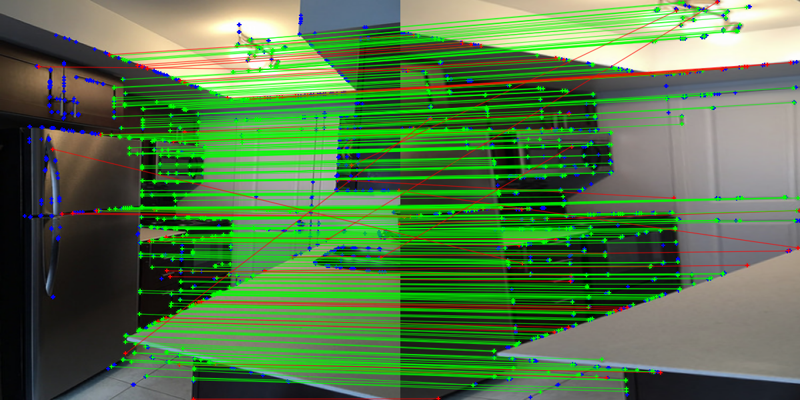
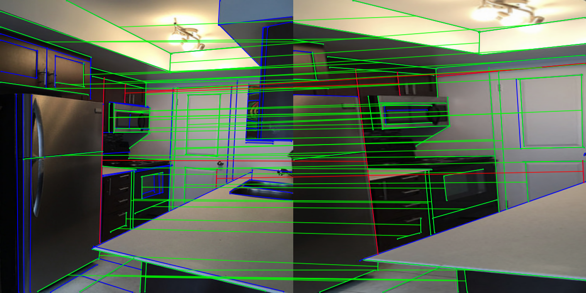

# LiKL
A Lightweight CNN model for joint detection and description of Keypoint and Line, which is capable of simultaneously extracting keypoint and line features in an image and inferring feature descriptors in a single process.

## Todo
- [ ] Training code
- [x] [C++ implementation](https://github.com/hjshxb/LiKL-cpp)

## Demo




## Usage
### Dependency
```shell
pip install -r requirements.txt
```

### Pre-trained model
You can download pre-trained model from [Baidu (kcdd) ](https://pan.baidu.com/s/13gWgh-rO9x1Jy-AvwN3Alg) or [Onedrive](https://1drv.ms/u/s!Ah0c5cK_vtly10EJ104KVA0t_nBh)

### How to use it
1. Set pre-trained model path in `likl/config/extract_cfg.yaml`
2. You can use `notebooks/extract_feature.ipynb` to use the model and visualize the results.

### Convert model to other formats
- [x] torchscript
- [x] onnx
```shell
python convert_model.py --weight <path-to-pretrained-weights> --file <path-to-converted-file> --fmt "onnx or torchscript"
```
